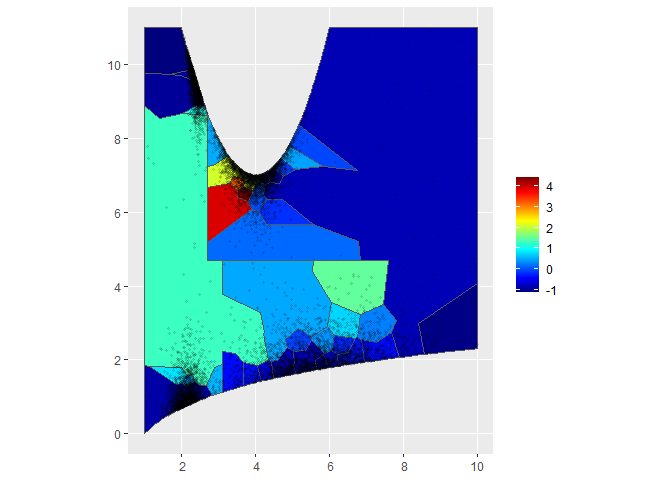

<!-- README.md is generated from README.Rmd. Please edit that file -->

# amgfl (v0.1.0)

<!-- badges: start -->
<!-- badges: end -->

This package implements trend estimations by semiparametric additive
model with graph trend filtering via generalized fused Lasso.
Furthermore, with the trend estimation results, it provides simultaneous
confidence intervals via the bootstrap.

**cite this package:**  
Ohishi, M., Fukui, K. & Yanagihara, H. (2023). amgfl: Trend estimations
by semiparametric additive model with graph trend filtering via
generalized fused Lasso. R package version 0.1.0.
<https://github.com/ohishim/amgfl>

## Installation

You can install the R package amgfl like so:

``` r
# install.packages("devtools")
devtools::install_github("ohishim/amgfl")
```

## Description

This is a basic example which shows you how to solve a common problem:

``` r
library(amgfl)

res <- amgfl(dataset, space, nknots)  # estimation
CI <- amgfl.CI(res)                   # simultaneous confidence intervals
```

This package can handle three cases:  
- (D1) a space division is given by a user.  
- (D2) a space is divided by `amgfl`.  
- (D3) a space is divided by `amgfl` for each subregion.

The three cases are decided by the definition of the parameter `space`.

**(D1)** The `space` is defined by

``` r
space <- list(
  area = area, 
  adjacent = adjacent, 
  Sp = Sp,           # optional
  div.pol = div.pol  # optional
)
```

in which names of each element must be given. The `area` is a vector of
integers expressing sub-areas for each individual. The `adjacent` is a
matrix with two columns expressing adjacent relationships among
sub-areas. For example, consider the following adjacent relationships
among four sub-areas:


where a line indicates the two sub-areas are adjacent. Then, `adjacent`
must be defined by

    #>      [,1] [,2]
    #> [1,]    1    2
    #> [2,]    1    3
    #> [3,]    1    4
    #> [4,]    2    1
    #> [5,]    3    1
    #> [6,]    3    4
    #> [7,]    4    1
    #> [8,]    4    3

The `Sp` is an optional parameter which is a matrix with two columns
expressing coordinates of observed points. If it is defined, figures in
the output of `amgfl` have the observed points.  
The `div.pol` is an optional parameter which is an optional parameter
which is an sfc_POLYGON object expressing a spatial division. If it is
defined, clustering result is output as a figure.

**(D2)** The `space` is defined by

``` r
space <- list(
  Sp = Sp, 
  m = m,       # optional
  spB = spB,   # optional
  seed = seed  # optional
)
```

in which names of each element must be given. The `Sp` is the same of
(D1) but must be required. The `m` is an optional parameter expressing
the number of sub-areas. If `m` is not given, it is defined by
`nrow(Sp) %>% divide_by(100) %>% ceiling`. The `spB` is an optional
parameter which is an sfc_POLYGON object expressing a boundary of the
space subjected to analysis. If `spB` is not given, it is defined by a
convex hull of the observed points. The `seed` is an optional parameter
which is the first parameter of `set.seed`. In this case, with `Sp` and
`m`, the space is divided by the following procedure:  
1. calculate `m` central points by `kmeans(Sp, m)`.  
1. with the `m` points, the space is divided in `m` sub-areas by a
voronoi tessellation implemented by sf package.

To fix the result by `kmeans`, `seed` is required.

**(D3)** The `space` is defined by

``` r
space <- list(
  Sp = Sp,
  spB = spB, 
  subregion = subregion, 
  m = m,       # optional
  seed = seed  # optional
)
```

in which names of each element must be given. The `Sp` is the same of
(D1) and (D2). The `spB` is an sfc_POLYGON object expressing a boundary
of each subregion. The `subregion` is a vector expressing subregion for
each individual. The `m` is an optional parameter which is a vector
expressing the numbers of sub-areas for each subregion. The `seed` is
the same of (D2).

## Example

This package has the following example data:

``` r
head(exData)
#>           y        V1         V2          V3         V4     long     lati
#> 1  7.147787 0.2340255 0.27553727 0.403534100 0.21226390 2.295924 9.121579
#> 2 10.024639 0.2761078 0.93363799 0.167839285 0.21380928 2.290344 1.282944
#> 3 13.454960 0.4860557 0.97657660 0.006170198 0.32267522 5.579785 1.886710
#> 4  6.819030 0.7334012 0.03925697 0.886020254 0.47372817 2.260650 1.070693
#> 5 14.246701 0.1129188 0.96067044 0.855784846 0.85924074 5.767424 1.823993
#> 6  5.877807 0.3252610 0.63776838 0.443641463 0.06113688 5.073171 7.631240
#>   subregion
#> 1         A
#> 2         C
#> 3         D
#> 4         C
#> 5         D
#> 6         B
```

Moreover, `exSR` has an information of subregion in `exData`. The
example space is visible as

``` r
library(ggplot2) 

ggplot() + 
  geom_sf(data=exSR, aes(fill=subregion)) + 
  geom_point(data=exData, aes(x=long, y=lati))
```

 For
such data, case (D3) is executed as

``` r
library(magrittr)

dataset <- list(
  y = exData$y, 
  X2 = exData %$% cbind(V1, V2, V3, V4) 
)

space <- list(
  Sp = exData %$% cbind(long, lati), 
  spB = exSR$geometry, 
  subregion = exData$subregion
)

res <- amgfl(dataset, space, 15)
```

Then, the space is divided for each subregion as

``` r
res$division
```


Trends for explanatory variables and spatial effects are obtain as

``` r
res$trends.all
```


``` r
res$cluster
```


Note that a figure `trends.all` has densities of each variable in the
bottom but it looks a thick line in the above figure because the four
variables are generated by a uniform distribution.

## Reference

1.  Yamamura, M., Yanagihara, H., Ohishi, M., Fukui, K., Solvang, H.,
    Øien, N. & Haug, T. (2023). Estimation of spatial effects by
    generalized fused Lasso for nonuniformly sampled spatial data: an
    analysis of the body condition of common minke whales (*Balaenoptera
    acutorostrata acutorostrata*) in the Northeast Atlantic. *Hiroshima
    Statistical Group Technical Report*, TR-No. 23-05, Hiroshima
    Univeristy.
    \[[PDF](http://www.math.sci.hiroshima-u.ac.jp/stat/TR/TR23/TR23-05.pdf)\]
